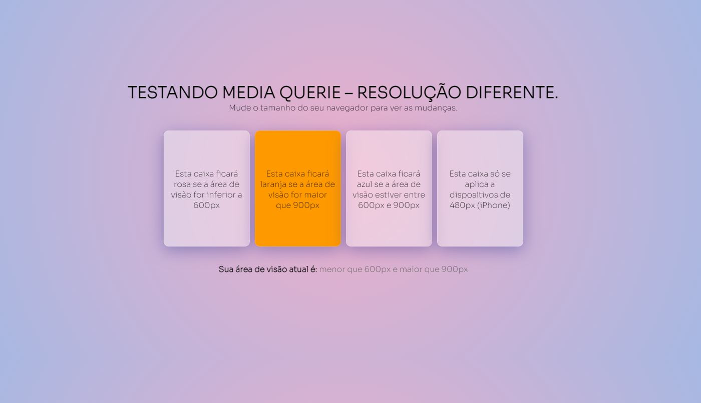

<h1 align="center">
    
    <br>
</h1>
<h4 align="center">
  <p>Media Query Responsiveness</p>

  <p>Project developed for the 2nd semester of Internet Systems at Fatec Taquaritinga College - 🇧🇷.</p>

  <p>The website was created using HTML and CSS.</p>
</h4>

## :rocket: Technologies

This project was developed using the following technologies:

- [HTML](https://developer.mozilla.org/pt-BR/docs/Web/HTML)
- [CSS](https://developer.mozilla.org/pt-BR/docs/Web/CSS)

## :information_source: How to use

To clone this application, you will need [Git](https://git-scm.com) installed on your computer. And from the command line:

```bash
# Clone the repository
$ git clone https://github.com/M4NT/MediaQueryResponsiveness.git

# To go to the repository
$ cd MediaQueryResponsiveness

# Go to index.html
# Right click
# Open with Live Server
```
---
